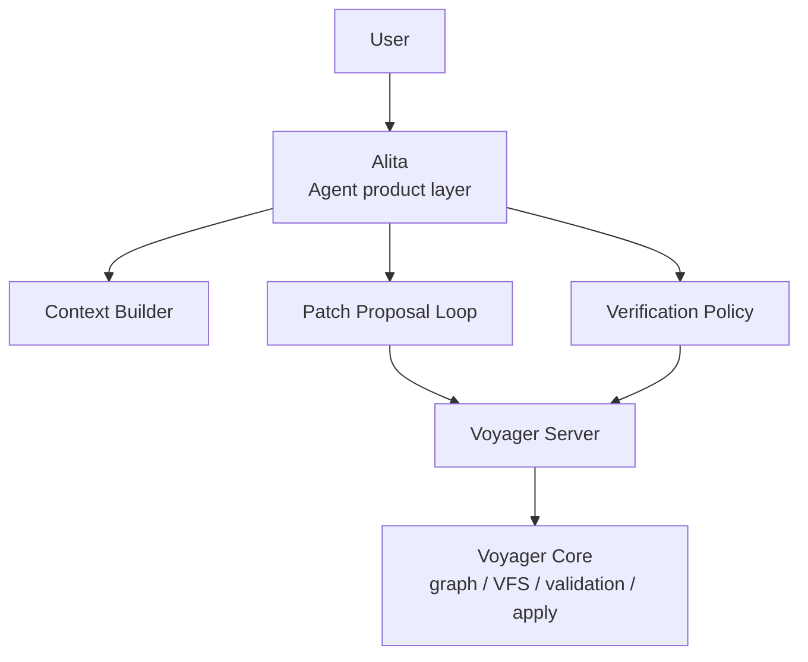

# Alita Agent Workflow

## Product Naming

Voyager and Alita are intentionally different product layers:

```text
Voyager = engineering substrate
- semantic graph
- patch validation
- VFS transaction
- JDT LS lifecycle
- Server
- atomic apply and rollback

Alita = agent product layer
- understands the user's task
- gathers project context
- proposes patch sets
- asks Voyager to validate patches
- revises rejected patches
- coordinates verification and human approval
```

The naming rule is:

- **Voyager** is the system that validates and applies source changes.
- **Alita** is the Agent product powered by Voyager.
- Voyager should stay a quiet engineering layer.
- Alita should be the human-facing agent experience.

In one sentence:

> Alita thinks and proposes; Voyager validates and commits.

This avoids the confusing shape where "Voyager the Agent" talks to "Voyager the
Server" through "Voyager the CLI". It also leaves room for Alita to feel less
like a command-line subtool and more like an agent surface with modes.

---

## Product Shape

Alita is not one of many named agents. Alita is the Agent layer itself.

The future product can expose modes similar to modern coding tools:

```text
Alita Agent Mode  = autonomous patch loop for a bounded task
Alita Ask Mode    = answer questions from graph, files, docs, and search
Alita Plan Mode   = build an implementation plan without applying code
Alita Debug Mode  = explain failed patches, diagnostics, tests, or builds
```

These are modes of Alita, not separate agents. V1 should avoid designing a
multi-agent marketplace or a cast of agent personas. One focused agent layer is
enough.

The CLI may temporarily expose Alita while the product surface is still local,
but the product should not be designed as a purely command-line feature. A CLI
entrypoint is only an integration path for development, tests, and automation.
The intended experience can later become IDE, TUI, desktop, or chat-native
without changing the Voyager core contract.

---

## Layering



Alita can be stateful and conversational, but writes must still flow through
Voyager patch validation. The public edit API remains patch-only.

---

## Future Workflow

```text
User Task
  -> Alita builds context
  -> Alita drafts a unified diff patch set
  -> Voyager plan patch
      -> valid: produce a checkpoint for approval
      -> rejected: return structured diagnostics / hunk errors / compile errors
  -> Alita revises the patch if needed
  -> user approves or policy allows auto-apply
  -> Voyager apply
  -> verification commands run
  -> Alita summarizes result and residual risk
```

The first implementation should optimize for a reliable single-task loop rather
than ambitious multi-agent planning. The core invariant stays:

> Alita may propose changes, but Voyager decides whether a patch is safe enough
> to commit.

---

## Next Six Work Items

### 1. Agent Run Model

Define local run records:

```text
AgentTask
AgentRun
AgentStep
AgentArtifact
```

They should capture:

- user task,
- gathered context,
- proposed patch text,
- plan result,
- apply result,
- validation output,
- verification output,
- final summary.

For V1, local JSON under `.voyager/` is enough. The goal is debuggability and
replay, not a database.

### 2. Context Builder

Build a conservative context pack from:

- `.voyager/graph.json`,
- `rg` search results,
- selected source file snippets,
- project rules,
- nearby design docs and examples when relevant.

The semantic graph should be used for candidate entry points and affected-file
hints. It must not be treated as a complete Java PSI or call graph.

### 3. Patch Proposal Loop

Alita drafts unified diff patch sets and sends them to Voyager through
`operation/plan`.

If planning is rejected, Alita should revise the patch using:

- structured LSP diagnostics,
- hunk mismatch messages,
- VFS validation errors,
- snapshot compile check output,
- post-validation errors.

Alita should not directly edit source files or bypass Voyager's patch pipeline.

### 4. Agent Product Entrypoint

The first local development entrypoint can be command-like, but product design
should keep Alita above the CLI layer.

Temporary local shape:

```bash
voyager alita run "rename orderId to externalOrderId"
voyager alita status
```

Possible future product shape:

```text
alita
  Agent mode
  Ask mode
  Plan mode
  Debug mode
```

The important design note: Alita is an Agent experience. Do not overfit the
workflow to command-line flags before the interaction model is discussed.

### 5. Verification Policy

After apply, Alita should run verification commands based on project policy.

Examples:

```text
python -m compileall -q src tests examples/e2e_v1.py
python -m pytest -q
mvn test
gradle test
custom project commands
```

This must be configurable. Verification commands should not be hard-coded into
the agent loop beyond a small default for this repository's own tests.

### 6. Checkpoint And Human Approval

The first Alita implementation should default to stopping at a valid plan:

```text
patch proposed -> Voyager plan valid -> wait for approval -> Voyager apply
```

Later, an explicit auto-apply policy can allow:

```text
patch proposed -> plan valid -> apply -> verify
```

Human approval keeps V1 safe while the agent loop is young. `--yes`-style
automation can come after the run records, diagnostics, and verification story
are reliable.

---

## Non-Goals For First Alita Version

- Do not introduce public semantic edit operations such as rename/add/remove
  field commands.
- Do not let Alita write source files directly as the final commit path.
- Do not require a full Java PSI or call graph before the first workflow exists.
- Do not design multi-agent orchestration yet.
- Do not make the Agent layer feel like only a command-line wrapper.

Alita V1 should be a careful patch-planning loop on top of Voyager, not a second
editing engine.
