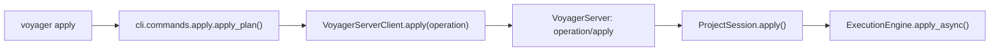
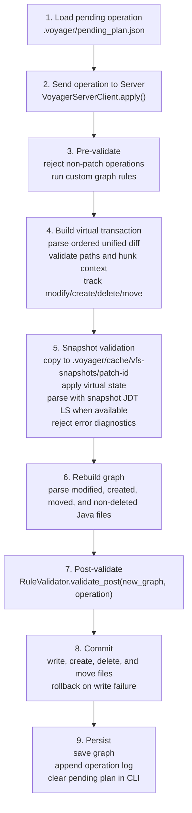

# Apply Pipeline

This document describes the current V1 apply path. `patch` is the only public
edit operation. Internally, Voyager applies an ordered patch set to a virtual
filesystem, validates the resulting project snapshot, then commits atomically.

In normal CLI usage, apply runs inside the project-scoped Voyager Server:



`ExecutionEngine.apply()` still exists as a synchronous wrapper for programmatic
use, but the Server path uses `apply_async()`.

---

## Pipeline



---

## Unified Diff Patch

`patch` is designed for coding agents that naturally work through CLI tools:

```bash
voyager plan patch agent.patch
voyager plan patch agent-1.patch agent-2.patch
voyager apply -y
```

The operation stores unified diff text in `.voyager/pending_plan.json`. During
plan, Voyager parses the full patch set, rejects unsafe paths, checks that all
hunks apply in order against exact virtual-file context, and validates a
temporary project snapshot. During apply, Voyager repeats that virtual apply and
validation before committing.

Supported patch effects:

- modify existing files,
- create new files with `/dev/null` as the old path,
- delete files with `/dev/null` as the new path,
- move files with `diff --git` `rename from` / `rename to` metadata,
- move and modify a file in the same patch section,
- apply multiple patch files to the same virtual file in order.

Voyager does not expose separate public edit operations. Source and file changes
should be represented as patches.

---

## Snapshot Validation

JDT LS is built around real workspace/file URIs, so Voyager does not try to make
JDT LS read an arbitrary in-memory VFS. Instead, it materializes a temporary
project snapshot under:

```text
.voyager/cache/vfs-snapshots/
```

The snapshot excludes `.git` and `.voyager`, applies the virtual final state, and
is then parsed through the normal Java parser path. If JDT LS is available and
the original project has Java build metadata (`pom.xml`, Gradle files, or
Eclipse `.classpath`/`.project`), Voyager starts a short-lived LSP client rooted
at the snapshot, enables diagnostics, opens Java files in the snapshot, and
rejects any error-level diagnostics before committing.

The project Server still owns a long-lived LSP client for the real project.
Snapshot validation deliberately uses its own LSP client because diagnostics
must refer to the virtual final state, not the live source tree. If JDT LS is
unavailable, or the project has no Java build metadata, snapshot diagnostic
validation is skipped and Voyager relies on exact patch/VFS validation plus
static graph rebuild.

The snapshot is deleted after validation.

---

## Atomicity

The engine builds every final `FilePatch` before writing anything.

```mermaid
flowchart LR
    source["source files"]
    vfs["patch-set virtual filesystem"]
    snapshot["snapshot validation"]
    graph["graph rebuild"]
    post["post-validation"]
    patch["FilePatch(original, modified, destination, delete)"]
    commit["commit"]

    source --> vfs --> snapshot --> graph --> post --> patch --> commit
```

If validation fails, no source file is touched.

If writing fails partway through commit, already-written files are restored from
their original content and moved destinations are removed.

---

## Error Cases

| Case | Result |
| --- | --- |
| non-patch operation | validation error, no files touched |
| patch contains no unified diff sections | validation error, no files touched |
| hunk context does not match | validation error, no files touched |
| path escapes project root | validation error, no files touched |
| patch creates an existing virtual file | validation error, no files touched |
| patch deletes a missing virtual file | validation error, no files touched |
| patch moves a missing file | validation error, no files touched |
| patch moves to an existing file | validation error, no files touched |
| patch set produces no final changes | validation error, no files touched |
| LSP snapshot validation fails | validation error, no files touched |
| LSP snapshot reports error diagnostics | validation error, no files touched |
| post-validation finds duplicate definitions | invalid result, no files touched |
| write failure | rollback attempted, error result |

---

## Current V1 Limits

- `patch` applies unified diffs exactly; it does not infer edit intent or transform source beyond the supplied patch.
- JDT LS snapshot diagnostics are skipped when JDT LS is unavailable or the project lacks Java build metadata.
- Static parsing is intentionally conservative.
- The semantic graph records conservative typed references; it is not a full Java PSI or call graph.
