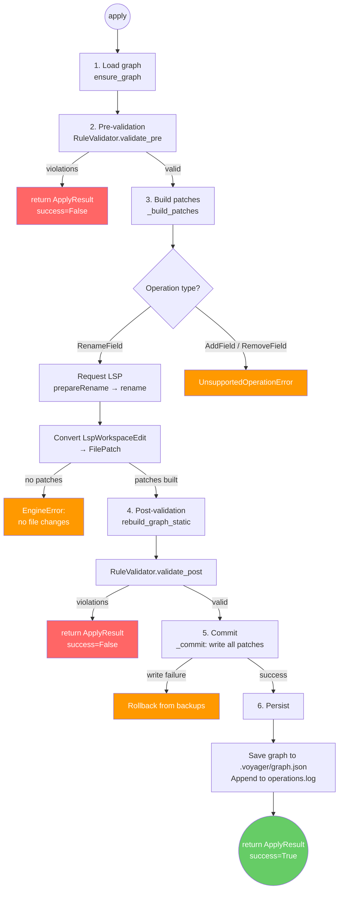

# Apply Pipeline

The `ExecutionEngine.apply()` method follows a fixed all-or-nothing pipeline:

## Error handling

- **Pre-validation failure**: short-circuits immediately, no files touched.
- **Post-validation failure**: patches are discarded (in-memory only), no files touched.
- **Write failure during commit**: all already-written files are rolled back from backups.
- **Unexpected exception**: treated as `INTERNAL_ERROR`, rolled back if possible.

## Key invariants

1. Either all patches are applied or none are (atomicity).
2. The graph on disk always matches the source code state.
3. `add_field` and `remove_field` are declared in models but not supported by the engine in V1.
