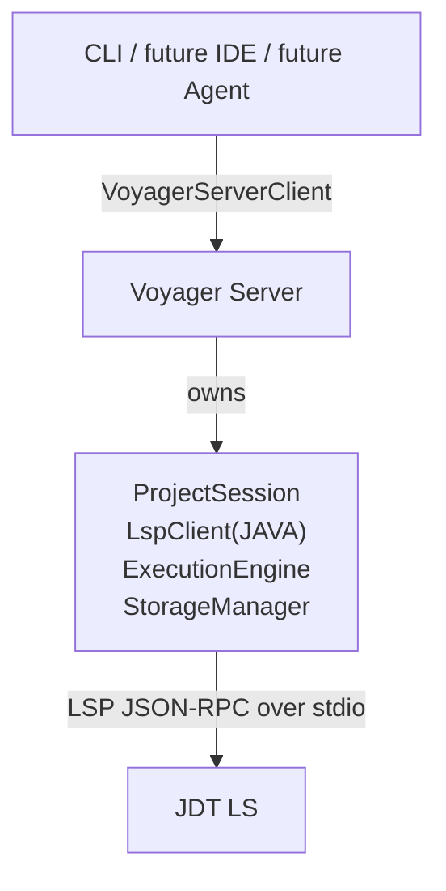
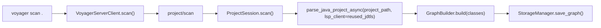

# Voyager V1 Architecture

## Scope

Voyager V1 solves one narrow problem:

> Let agents make code changes through verifiable patch transactions on top of a semantic graph.

The public edit API is patch-only:

```json
{
  "op": "patch",
  "patch": "--- a/src/main/java/com/shop/OrderDTO.java\n+++ b/src/main/java/com/shop/OrderDTO.java\n@@ ...\n",
  "patches": [
    "--- a/src/main/java/com/shop/UserDTO.java\n+++ b/src/main/java/com/shop/UserDTO.java\n@@ ...\n"
  ]
}
```

`patch` is intended for CLI-first coding-agent workflows. It parses ordered
unified diff text, validates that every path stays inside the project, applies
hunks to a virtual filesystem in task order, supports file creation/deletion and
git-style file moves, validates the resulting Java project snapshot, and commits
atomically.

Voyager no longer exposes `rename_field`, `rename_method`, `rename_class`,
`add_field`, `remove_field`, `add_file`, `remove_file`, or `move_file` as public
edit operations. Agents can express those changes as patches generated by normal
editor, OS, git, or CLI tooling.

---

## Design Principles

1. Patch-first: agents produce source edits as unified diffs.
2. Semantic validation: Voyager validates the patched project against the semantic graph.
3. Correctness over cleverness: when uncertain, reject the patch set.
4. All-or-nothing writes: partial success is not allowed.
5. Long-lived project context: JDT LS belongs to a project Server, not to each short CLI command.

---

## Runtime Architecture



The CLI is a client. `voyager start` explicitly starts the project-scoped Server
in the background, and `scan/plan/apply` still auto-start it on demand for
convenience. The Server owns a long-lived `ProjectSession`, which keeps JDT LS
warm across `scan -> plan -> apply`.

See [Voyager Server Mode.md](./Voyager%20Server%20Mode.md) for the detailed
Server lifecycle.

---

## Source Layout

```text
src/
|-- voyager_cmd/          # click CLI and runner API
|-- cli/commands/         # scan/plan/apply presentation
|-- core/
|   |-- server/           # VoyagerServer, client, local protocol
|   |-- session/          # ProjectSession
|   |-- parser/           # Java parser: LSP first, static fallback
|   |-- graph/            # SemanticGraph and GraphBuilder
|   |-- operation/        # patch-only operation/result models
|   |-- engine/           # plan/apply pipeline
|   |-- vfs/              # patch-backed virtual filesystem transaction
|   |-- lsp/              # LSP client and language config
|   |-- rules/            # pre/post validators
|   `-- diff/             # unified diff parser and applier
|-- storage/              # .voyager persistence
`-- utils/                # async helper
```

---

## Persistent Project State

All project-local derived state lives under the Java project root:

```text
.voyager/
|-- graph.json
|-- pending_plan.json
|-- operations.log
|-- rules.yaml
`-- cache/
    |-- server.json
    |-- server.log
    `-- vfs-snapshots/
```

`.voyager/cache/vfs-snapshots/` stores temporary project snapshots used for
patch semantic validation. Snapshots are deleted after validation. JDT LS
workspace data still lives in the user cache directory, keyed by project path,
so it does not pollute the scanned project.

One Java project root maps to one Voyager Server process. Different project
roots run independent Server processes, with isolated JDT LS workspaces, graphs,
pending plans, operation logs, and VFS snapshot directories.

---

## Scan



Parser strategy:

- If JDT LS is available, try LSP `textDocument/documentSymbol`.
- Run the static parser as a completeness check.
- If LSP output is incomplete or fails, fall back to static parsing.

This keeps `scan` useful even when JDT LS is not fully ready, while still using
LSP when it gives complete semantic facts.

---

## Plan

```mermaid
flowchart LR
    plan_cmd["voyager plan patch<br/>agent.patch / patch set"]
    plan_cmd --> build_op["build PatchOperation"]
    build_op --> client_plan["VoyagerServerClient.plan(operation)"]
    client_plan --> operation_plan["operation/plan"]
    operation_plan --> engine_plan["ExecutionEngine.plan_async()"]
    engine_plan --> pre_validate["RuleValidator.validate_pre()"]
    pre_validate --> vfs_tx["VirtualFileSystemTransaction"]
    vfs_tx --> snapshot["LSP-backed snapshot validation<br/>when JDT LS is available"]
    snapshot --> pending["save .voyager/pending_plan.json"]
```



`plan` does not write source files. It validates the patch set and reports the
final affected files. A bad hunk context, path escape, duplicate create, missing
delete target, invalid move, LSP snapshot failure, or no-op patch set is rejected
before `.voyager/pending_plan.json` is saved.

---

## Apply

```mermaid
flowchart LR
    apply_cmd["voyager apply -y"]
    apply_cmd --> read_plan["read .voyager/pending_plan.json"]
    read_plan --> client_apply["VoyagerServerClient.apply(operation)"]
    client_apply --> operation_apply["operation/apply"]
    operation_apply --> engine_apply["ExecutionEngine.apply_async()"]
    engine_apply --> pre_validate_apply["validate_pre"]
    pre_validate_apply --> vfs_tx_apply["VirtualFileSystemTransaction"]
    vfs_tx_apply --> materialize["materialize .voyager/cache/vfs-snapshots/patch-id"]
    materialize --> parse_snapshot["parse snapshot through short-lived JDT LS<br/>when available and project has build metadata"]
    parse_snapshot --> diagnostics["reject error diagnostics"]
    diagnostics --> rebuild["rebuild graph from virtual state"]
    rebuild --> post_validate["validate_post"]
    post_validate --> commit["commit all file changes"]
    commit --> persist["save graph and operation log"]
```



Patch construction is static and exact: Voyager does not try to infer intent or
perform semantic refactoring. Semantic confidence comes from applying the whole
task to a virtual filesystem, rebuilding the graph, and validating a temporary
project snapshot with LSP diagnostics when JDT LS is available and the project
has Java build metadata.

---

## VFS Transaction

The internal edit model is a task-level virtual filesystem transaction:

- Existing files start from disk content.
- New files exist only in memory until commit.
- Deleted files are marked deleted in the virtual view.
- Git rename metadata can move a file, with or without hunks.
- Multiple patches for the same file are applied in order to the current virtual content.
- Non-Java files can participate in the transaction, but only Java files affect the graph.

The final transaction is collapsed into `FilePatch` objects only after the whole
patch set has applied cleanly.

---

## Rules And Validation

Pre-validation checks:

- operation is a `patch`,
- project custom rules do not already block the graph.

Patch/VFS validation checks:

- every path is project-local,
- every hunk context matches exactly,
- create/delete/move state transitions are valid,
- the patch set produces at least one final file change.
- when JDT LS is available and the project has Java build metadata, the
  materialized snapshot must not publish error-level diagnostics for Java files.

Post-validation checks:

- duplicate Java class definitions are rejected,
- custom DTO uniqueness rules still pass.

If post-validation fails, no source file is written.

---

## Failure Model

Failure handling is conservative:

- pre-validation failure: return invalid result, touch no files;
- patch parse/VFS failure: return invalid result, touch no files;
- LSP snapshot validation failure: return invalid result, touch no files;
- post-validation failure: discard in-memory patches, touch no files;
- commit failure: roll back files already written from in-memory backups.

The graph on disk is updated only after successful commit.

---

## Patch Set Validation Algorithm

Voyager validates a task-level patch set, not just one patch file at a time. A
single agent task may produce several patches across several files, and the
correct question is whether the entire set can be applied as one atomic
transaction.

1. Parse
   - Parse every patch input into structured file sections and hunks.
   - Normalize paths to project-relative paths.
   - Reject invalid hunk headers, malformed file sections, and paths that escape
     the project root.

2. Apply To VFS
   - Apply multiple patches for the same file in task order.
   - Reject the whole patch set if any hunk context does not match.
   - Track creates, deletes, moves, and move-plus-modify edits as virtual state.

3. Snapshot
   - Copy the project into `.voyager/cache/vfs-snapshots/patch-<id>`.
   - Apply virtual deletes and overrides to that snapshot.
   - Exclude `.git` and `.voyager` from the snapshot copy.

4. Semantic Validation
   - Parse the snapshot with a short-lived JDT LS client when JDT LS is
     available and the project has Java build metadata.
   - Check error-level diagnostics across Java files in the snapshot and reject
     the patch set if compile/type errors are reported.
   - Build a graph from the virtual final state.
   - Run built-in and custom validators.

5. Commit
   - Commit the whole patch set atomically.
   - Roll back every written, created, deleted, or moved file if any write fails.
   - Persist the rebuilt graph only after commit succeeds.
   - Append the patch set to the operation log.

The guiding invariant is:

> A patch set is valid only if it applies cleanly to a virtual filesystem and the
> resulting project semantic state passes validation.

---

## V1 Non-Goals

V1 intentionally does not implement:

- a thick PSI-like editing layer,
- public semantic rename/add/remove operations,
- public file operation commands,
- full call graph,
- multi-language support,
- reflection or dynamic proxy analysis,
- Lombok generated-code analysis,
- Spring dependency injection analysis,
- automatic architecture design,
- multi-agent planning.

Those can be future features, but the current path is healthier if Voyager stays
focused on semantic graph visibility, patch validation, atomic commit, and safe
rollback.

---

## LSP Diagnostics

Snapshot validation uses a real temporary project plus the normal Java parser
path, so JDT LS can build document symbols and Voyager can rebuild the semantic
graph from the patched state. For projects with Java build metadata such as
`pom.xml`, Gradle files, or Eclipse `.classpath`/`.project`, Voyager starts a
short-lived snapshot-scoped LSP client with diagnostics enabled and rejects any
error-level diagnostics before source files are committed.

The long-lived Server-owned LSP client remains rooted at the real project and is
used for scan and graph loading. Snapshot validation intentionally uses a
separate client because diagnostics must describe the virtual final state under
`.voyager/cache/vfs-snapshots/`, not the live source tree.

If JDT LS is unavailable, or the project has no Java build metadata, V1 falls
back to exact patch/VFS validation and static graph rebuild. This avoids false
package-layout diagnostics for lightweight fixtures while still keeping the
stronger diagnostic gate for normal Maven/Gradle/Eclipse projects.
