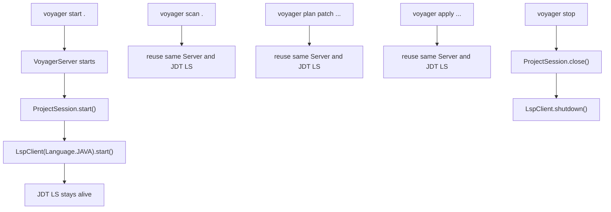

# JDT LS Dependency And Lifecycle

## Role In Voyager V1

Voyager V1 uses Eclipse JDT Language Server for Java semantic analysis and
patch snapshot validation.

JDT LS is required for:

- LSP-based `documentSymbol` scan when available,
- LSP-backed validation of temporary VFS project snapshots when available,
- error-diagnostic rejection for snapshot Java files in projects with Java build metadata.

JDT LS is not required for every V1 behavior:

- static parsing can still build a graph for simple projects,
- `plan` can run from the saved/static graph,
- patch construction and exact hunk application are static,
- snapshot validation falls back to the static parser if JDT LS is unavailable
  or the project has no Java build metadata.

`voyager status` reports all three capability facts for the current project:
whether JDT LS is discoverable, whether Java build metadata is present, and
whether snapshot diagnostics are active.

---

## Installation

Voyager expects `jdtls` to be discoverable on `PATH`.

Repository helper:

```bash
python -m scripts.setup_jdtls
python -m scripts.setup_jdtls --check
```

The helper downloads JDT LS into:

```text
scripts/jdtls/
```

and creates launcher scripts such as:

```text
scripts/jdtls.cmd
```

`scripts/jdtls/` is ignored by git because it contains downloaded binary/runtime files.

---

## Command Discovery

JDT LS command discovery lives in:

```text
src/core/lsp/config.py
```

For Java, the configured command is:

```python
command=["jdtls"]
```

On Windows, `LanguageConfig.find_server_command()` checks common executable suffixes:

- `.cmd`
- `.bat`
- `.exe`

If it finds `jdtls.cmd` or `jdtls.bat`, it wraps the command as:

```text
cmd.exe /c <resolved launcher>
```

---

## Runtime Lifecycle

JDT LS is no longer started once per CLI command. It is owned by the project-scoped Voyager Server.



This avoids repeated JDT LS startup/shutdown noise and keeps the Java index warm between commands.

---

## JDT LS Workspace

JDT LS needs a workspace directory for indexes and metadata. Voyager does not put this workspace under the scanned Java project.

Current behavior:

```text
%LOCALAPPDATA%/Voyager/jdtls-workspaces/<project-hash>/
```

or the equivalent user cache location on non-Windows systems.

Reason:

- avoids JDT LS indexing `.voyager/` or its own workspace,
- avoids polluting the Java project,
- allows one stable workspace per project path.

---

## LSP Client Responsibilities

Main file:

```text
src/core/lsp/client.py
```

Responsibilities:

- start JDT LS as a subprocess,
- perform LSP initialize/initialized handshake,
- send JSON-RPC messages over stdio,
- read responses and diagnostics,
- expose semantic methods:
  - `get_symbols()`
  - `get_references()`
  - `find_definitions()`
  - `find_implementations()`
  - `wait_for_diagnostics()`
- shut down the subprocess on `voyager stop`.

Server mode owns the long-lived `LspClient` for project scan and graph loading.
Patch snapshot validation uses temporary real project directories under
`.voyager/cache` so JDT LS can reason about normal file URIs. Snapshot
validation uses a separate short-lived `LspClient` rooted at the temporary
snapshot with diagnostics enabled; this keeps snapshot diagnostics isolated from
the long-lived project Server client.

When snapshot diagnostics report errors, Voyager rejects the plan/apply result
before writing source files. The engine returns structured diagnostics with
file, line, column, message, severity, source, and code, and the CLI groups that
output by file.

For Maven/Gradle projects where a compile command is available, snapshot
validation also runs a compile check as a backstop for diagnostics that arrive
late or remain quiet in a local LSP setup.

---

## Logging And Windows Encoding

Server logs go to:

```text
.voyager/cache/server.log
```

JDT LS stderr can contain characters that do not encode cleanly in the active Windows console code page. `LspClient` therefore decodes stderr with UTF-8 and common Windows fallbacks, and logs sanitized text.

Known JDT LS shutdown noise is filtered where possible, because JDT LS may emit diagnostics during platform shutdown even after the requested operation has completed successfully.

---

## Failure Policy

If JDT LS cannot be found:

- `scan` may still fall back to static parser,
- `plan` and `apply` may still validate patches through exact hunk application
  and static graph rebuild,
- LSP snapshot validation is skipped.

If the project has no Java build metadata (`pom.xml`, Gradle files, or Eclipse
`.classpath`/`.project`), Voyager also skips LSP snapshot diagnostics. This
avoids false package-layout diagnostics on lightweight source-only fixtures.

This is intentional for V1 testability and lightweight environments. The
long-term direction is to strengthen semantic snapshot validation without
reintroducing PSI-like edit operations.

---

## Related Files

| File | Purpose |
| --- | --- |
| `scripts/setup_jdtls.py` | optional helper to download/install JDT LS |
| `scripts/jdtls.cmd` | Windows launcher checked by PATH |
| `src/core/lsp/config.py` | command discovery and Java LSP settings |
| `src/core/lsp/client.py` | LSP subprocess and JSON-RPC client |
| `src/core/session/project_session.py` | owns the long-lived `LspClient` |
| `src/core/server/server.py` | owns `ProjectSession` lifetime |
