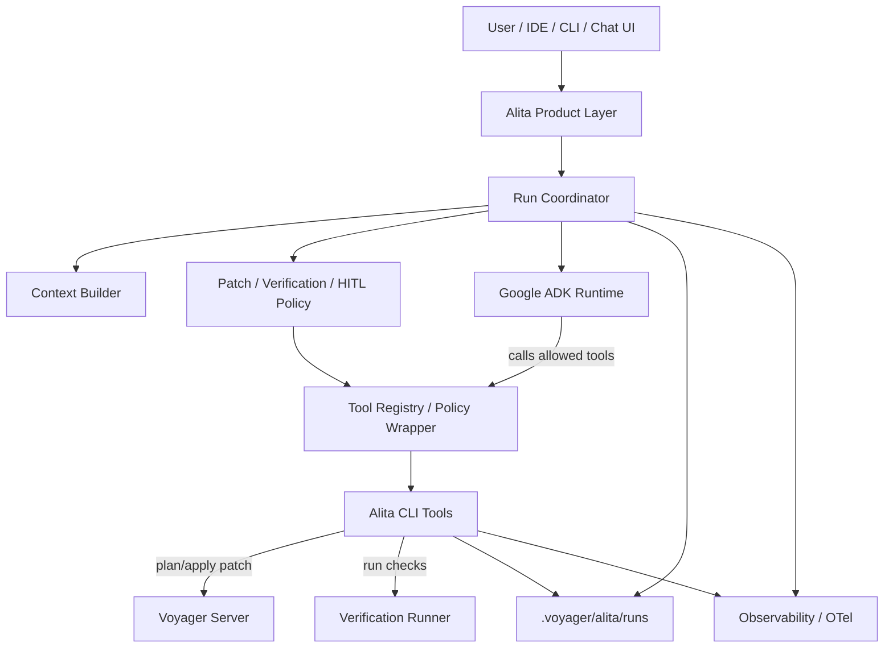

# Voyager V1 Next Steps

This document captures the next two architecture workstreams after the current
patch-first Server mode:

1. Align Voyager's CLI patch surface with Git's official diff-format.
2. Build Alita as an ADK-backed Agent product layer with Voyager-aware tools,
   policy gates, HITL, streaming, run records, and observability.

The goal is to keep Voyager as the commit authority while making Alita a
CLI-friendly, provider-flexible, auditable coding Agent.

---

## Workstream 1: Git Diff-Format Compatible CLI

Voyager's public edit API remains patch-only. The canonical patch language
should be Git-style unified diff, because it is the most common interchange
format for command-line tools, human review, and coding agents.

The current command shape is:

```bash
voyager plan patch <patch_file|-> [<patch_file>...] [--json]
voyager apply -y [--json]
voyager status [--json]
voyager progress [--json]
```

The next step is not to introduce a new semantic edit API. It is to tighten the
CLI and parser contract so Voyager clearly accepts the Git diff-format subset it
can validate and clearly rejects unsupported patch features.

### Target Contract

Canonical accepted input:

- unified diff file sections with `---` and `+++` headers,
- `diff --git` sections,
- `/dev/null` create/delete file sections,
- git rename metadata with `rename from` and `rename to`,
- rename plus content modification,
- ordered patch sets across one or more patch files,
- stdin input through `-`.

Explicitly rejected input:

- binary patches,
- symlink patches,
- chmod or mode-only patches,
- non-UTF-8 target files,
- paths outside the project root,
- empty or no-op patch sets,
- hunks whose context does not match exactly.

The implementation should keep parsing exact and conservative. Voyager should
not infer edit intent from malformed patches.

### CLI Direction

Keep the human and agent path CLI-first:

```bash
git diff > agent.patch
voyager plan patch agent.patch
voyager apply -y
```

Also support direct pipeline use:

```bash
git diff | voyager plan patch -
```

For Alita and future IDE integrations, use machine-readable output rather than
a separate write path:

```bash
voyager plan patch agent.patch --json
voyager apply -y --json
voyager status --json
voyager progress --json
```

The JSON output should expose:

- validity or success,
- affected or modified files,
- structured validation errors,
- structured LSP diagnostics,
- operation or run identifiers when available.

### Adapter Boundary

Voyager should treat Git-style unified diff as the canonical internal patch
format. Other agent edit formats can be accepted later through adapters, but
they should normalize before Voyager validates and commits.

Possible future adapters:

- Codex-style `apply_patch` envelope,
- Aider-style `udiff`,
- Aider-style search/replace blocks.

Adapters must not bypass the VFS transaction, snapshot validation, semantic
validation, or atomic commit path.

### Current CLI Baseline

Implemented in the current V1 CLI:

- `voyager plan patch <patch_file|-> [<patch_file>...]`,
- `voyager apply -y`,
- `voyager plan patch ... --json`,
- `voyager apply -y --json`,
- `voyager status --json`,
- `voyager progress --json`,
- stdin patch input through `-`,
- tests for `diff --git` modify sections,
- tests for `new file mode 100644` and `deleted file mode 100644` text sections,
- tests for stdin patch input,
- tests for JSON error output on invalid patch files and missing pending plans.

### Remaining Implementation Tasks

These items are optional follow-ups. They should not block the first Alita
runtime/tooling work unless Alita's implementation discovers it needs one of
them immediately.

1. Add `voyager scan <project_path> --json` so Alita can avoid parsing Rich
   table output after scan.
2. Consider adding a check-oriented alias if it improves agent ergonomics:
   `voyager check patch <patch_file|-> --json`. This would be equivalent to
   `voyager plan patch ... --json` and should not introduce a separate
   validation path.
3. Consider adding a pending-plan inspection command:
   `voyager plan show --json`, returning the current
   `.voyager/pending_plan.json` operation and basic metadata.
4. Formalize stable JSON contracts for:
   - `PlanResult`,
   - `ApplyResult`,
   - `status --json`,
   - `progress --json`,
   - structured diagnostics.
5. Add focused tests for remaining Git diff-format edge cases:
   - paths containing spaces if support is intentionally added,
   - quoted Git paths if support is intentionally added,
   - additional Git metadata lines that should be ignored for text patches.
6. Keep rejecting unsupported binary, symlink, chmod/mode-only, and non-UTF-8
   targets with stable structured errors.
7. Run `python -m pytest -q` and `python examples/e2e_v1.py` after changes.

---

## Workstream 2: Alita Agent Architecture

Alita is the Agent product layer powered by Voyager. The preferred direction is
to use Google ADK as the general Agent runtime and keep Alita's domain logic in
its own coordinator, tools, policies, run records, and trace schema.

The boundary is:

```text
ADK runs the Agent.
Alita defines the coding workflow.
Voyager validates and commits patches.
```

### System Shape



ADK should provide model calls, streaming, tool calling, sessions, model routing,
logging, metrics, and OpenTelemetry traces. Alita should provide the
Voyager-aware workflow and auditable artifacts.

### Provider Direction

Alita should be provider-flexible from the start. The initial provider path can
use ADK model configuration plus LiteLLM or OpenAI-compatible profiles.

Required provider targets:

- OpenAI,
- Gemini,
- Anthropic,
- Qwen,
- Doubao,
- Kimi,
- GLM.

Many of these can start as OpenAI-compatible profiles, but Alita should track
capability differences explicitly:

```text
ProviderProfile
- name
- model
- base_url
- api_key_env
- adk_backend
- litellm_model_prefix
- supports_streaming
- supports_tool_calling
- supports_json_schema
- supports_usage
- supports_reasoning
- extra_headers
- extra_body
```

Native adapters can be added later for provider-specific features that matter to
Alita.

### Alita CLI Tools

Alita tools should be CLI-first because coding models work well with command
surfaces and textual patch artifacts. ADK tool calls can wrap these same tool
implementations.

Core tools:

```text
alita tool search-code
alita tool read-context
alita tool inspect-graph
alita tool plan-patch
alita tool apply-patch
alita tool verify
alita tool status
```

The write-related tools should use Voyager underneath:

```text
voyager alita tool plan-patch --patch agent.patch --json
voyager alita tool plan-patch --patch - --json
voyager alita tool apply-patch --plan current --json
voyager alita tool apply-patch --plan current --yes --json
voyager alita tool status --json
alita tool verify --profile default --json
```

`plan-patch` is normally safe for the Agent to call directly because it does not
write source files. `apply-patch` must be policy-gated. JSON mode should not
block on an interactive prompt; agents can inspect an `ask_user` decision and
resume with explicit approval.

Current MVP commands:

```bash
voyager alita run "<task>" --patch <patch_file|-> [--active-file <file>] [--json]
voyager alita agent run "<task>" --runtime manual --patch <patch_file|-> [--json]
voyager alita agent run "<task>" --runtime adk --provider gemini --model <model> [--json]
voyager alita tool plan-patch --patch <patch_file|-> [--json]
voyager alita tool apply-patch --plan current [-y|--yes] [--json]
voyager alita tool status [--json]
```

`voyager alita run` is a manual-patch bridge, not the final ADK-backed Agent
runtime. It builds a context pack, records the supplied patch, calls Voyager
plan, saves a pending plan when valid, and stops before apply.

`voyager alita tool plan-patch/apply-patch/status` are the first CLI-first tool
surfaces. They use the same policy-aware registry that future ADK tool calls
should wrap.

`voyager alita agent run` is the first runtime-backed Agent entrypoint. The
`manual` runtime treats `--patch` as the model-produced patch for local testing.
The optional `adk` runtime uses Google ADK when `google-adk` is installed and
emits Alita runtime events plus a final patch proposal for Voyager planning.

### Policy Wrapper And HITL

Run Coordinator builds policy from project configuration, user preference, and
run mode. The policy wraps tools before they are registered with ADK.

Invocation path:

```text
Agent tool call
-> Tool Registry
-> Policy Wrapper
-> allow / deny / ask user
-> Alita Tool implementation
-> Voyager Server or Verification Runner
```

Write operations should support these HITL modes:

```text
manual_confirm
- all writes require user confirmation
- default for early Alita runs

allowlist
- matching writes auto-execute
- non-matching writes ask for confirmation

denylist
- matching writes are rejected
- non-matching writes follow the fallback mode

auto_execute
- writes execute without confirmation when they are not denied
- still goes through Voyager plan/apply validation
```

Suggested policy shape:

```yaml
write_policy:
  mode: manual_confirm
  allow:
    - "src/**"
    - "tests/**"
    - "designs/**"
  deny:
    - ".git/**"
    - ".env"
    - "**/*secret*"
    - "**/credentials/**"
  require_confirm:
    - "pyproject.toml"
    - "pom.xml"
    - "package.json"
  max_files_changed: 20
  max_patch_bytes: 200000
```

Every write request should be represented as a `WriteIntent` before it is
allowed to execute:

```text
WriteIntent
- tool_name
- operation_type
- affected_files
- patch_summary
- risk_level
- validation_result
- requested_by
- run_id
```

Even in `auto_execute`, Voyager remains the commit authority. The policy can
skip a human prompt, but it must not bypass validation or run records.

Current MVP baseline:

- `WritePolicyConfig` supports `manual_confirm`, `allowlist`, `denylist`, and
  `auto_execute`.
- `WriteIntent` records the requested future write operation after a valid
  Voyager plan.
- `PolicyDecision` returns `allow`, `deny`, or `ask_user`.
- Write policy denies unvalidated or rejected plans even when
  `auto_execute` is selected.
- `AlitaToolRegistry` is the first policy-aware tool facade. It exposes
  `voyager_plan_patch` as a safe planning tool and wraps `voyager_apply_patch`
  with the HITL policy gate before any source write can happen.
- `ask_user` decisions can be resumed with explicit human approval. The CLI
  supports interactive approval in human mode and `--yes` approval in automated
  mode.
- `voyager alita tool plan-patch` saves a pending plan when the plan is valid
  and not denied by policy.
- `voyager alita tool apply-patch` replans the pending patch, evaluates policy,
  applies through Voyager only when allowed or approved, and clears the pending
  plan only after a successful apply.
- `voyager alita tool status` reports local pending-plan and latest-run state.
- `ProviderProfile` covers OpenAI, Gemini, Anthropic, Qwen, Doubao, Kimi, and
  GLM. Gemini uses the native ADK model path; the other providers start through
  the LiteLLM/OpenAI-compatible path with overridable model, base URL, and API
  key environment variables.
- `AlitaRuntime` defines the runtime boundary. Current implementations are
  `manual` for deterministic local runs and optional `adk` for Google ADK.
- The ADK adapter registers read-only/safe tools for `read_context_pack` and
  `voyager_plan_patch`. Final source writes remain outside ADK and still go
  through Alita policy plus Voyager apply.
- `voyager alita run` writes `write-intent.json` and `policy-decision.json`
  when planning succeeds.
- The default policy is `manual_confirm`, so valid plans produce an `ask_user`
  decision before any apply step.

Remaining policy work:

- load project/user policy configuration from a stable file,
- expand ADK tool registration beyond safe planning once approval semantics are
  fully represented in ADK tool confirmation.

### Context Builder

Context Builder is a core Alita asset. It should produce a deterministic,
auditable context pack instead of directly stuffing arbitrary files into a
prompt.

Inputs:

- user task,
- active file and open tabs from the client,
- explicit files or symbols mentioned by the user,
- `.voyager/graph.json`,
- project rules,
- `rg` search results,
- nearby tests and examples,
- relevant design documents,
- recent Alita run records,
- recent diagnostics or verification failures.

Discovery strategy:

```text
Graph-guided
- resolve class / method / field
- affected file hints
- typed references

Search-guided
- rg user keywords
- rg symbol names
- rg diagnostic text

Structure-guided
- active file
- open tabs
- nearby tests
- build/config files
- designs and examples

History-guided
- previous rejected plans
- previous verification failures
- previous run summaries
```

Context should be tiered by importance:

```text
Tier 0: user task, active file, explicit files, current mode
Tier 1: direct implementation files or design docs
Tier 2: tests and examples proving behavior
Tier 3: related references from graph/search
Tier 4: historical run records and broad docs
```

First implementation should avoid a vector database. Start with deterministic
graph/search/file collection, token budgeting, and a saved artifact.

Suggested artifact:

```text
.voyager/alita/runs/<run_id>/context-pack.json
```

### Run Records

Alita run records are local, auditable facts independent of ADK traces.

Suggested layout:

```text
.voyager/alita/runs/<run_id>/
|-- run.json
|-- context-pack.json
|-- prompt.md
|-- patch-attempt-1.diff
|-- plan-result-1.json
|-- patch-attempt-2.diff
|-- apply-result.json
|-- verification.log
`-- summary.md
```

Run records should include:

- task,
- mode,
- model provider and model name,
- policy snapshot,
- context pack metadata,
- patch attempts,
- Voyager plan/apply results,
- approval decisions,
- verification output,
- final summary.

Current MVP run records include:

- `run.json`,
- `context-pack.json`,
- `runtime-result.json` for runtime-backed agent runs,
- `events.jsonl` for Alita runtime/domain events,
- `patch-attempt-1.diff`,
- `tool-call-plan-patch-1.json`,
- `plan-result-1.json`,
- `write-intent.json` for valid plans,
- `policy-decision.json` for valid plans,
- `summary.md`.

`prompt.md`, `apply-result.json`, and `verification.log` will be added with the
runtime and verification slices.

### Alita Trace Semantics

ADK traces should be correlated with Alita run IDs, but Alita needs its own
domain events:

```text
alita.run.started
alita.context_pack.started
alita.context_pack.completed
alita.model.stream.delta
alita.patch.generated
alita.voyager.plan.started
alita.voyager.plan.rejected
alita.diagnostics.feedback_sent
alita.patch.revised
alita.voyager.plan.accepted
alita.approval.waiting
alita.voyager.apply.committed
alita.verify.started
alita.verify.completed
alita.run.completed
```

These events should be written to run records and exported to observability
backends when configured.

### First Alita Milestone

Current MVP baseline:

- local run records under `.voyager/alita/runs/<run_id>/`,
- deterministic context pack with task, active-file hint, graph summary, and
  core Voyager constraints,
- runtime abstraction with `AlitaRuntimeRequest` and `AlitaRuntimeResult`,
- provider profiles for OpenAI, Gemini, Anthropic, Qwen, Doubao, Kimi, and GLM,
- optional Google ADK adapter behind `--runtime adk`,
- `manual` runtime for deterministic model-free agent runs,
- manual patch attempt recording,
- Voyager plan integration through `AlitaToolRegistry`,
- tool-call artifact recording for `voyager_plan_patch`,
- pending-plan save when the plan is valid,
- HITL policy evaluation after valid plans,
- policy-gated `voyager_apply_patch` facade with human approval and
  auto-execute support,
- CLI-first Alita tools for `plan-patch`, `apply-patch`, and `status`,
- `voyager alita run "<task>" --patch <patch_file|-> [--json]`,
- `voyager alita agent run "<task>" --runtime manual|adk ... [--json]`,
- `voyager alita tool plan-patch/apply-patch/status`.

Remaining first milestone tasks:

1. Expand the deterministic Context Builder for the current repository.
2. Add a real ADK integration smoke test gated by environment variables.
3. Add CLI-first Alita `verify` tool and configurable verification profiles.
4. Expand streaming event translation from ADK events to Alita events.
5. Add Alita trace events and correlate them with ADK/OpenTelemetry traces.
6. Persist approval/apply tool-call artifacts into run records.
7. Run repository tests and example flows after each implementation slice.

---

## Required Verification For These Workstreams

For any code changes in these workstreams:

```bash
python -m pytest -q
python examples/e2e_v1.py
```

If CLI behavior changes, also update:

- `designs/V1/Architecture V1.md`,
- `designs/V1/Apply Pipeline.md`,
- `designs/V1/Voyager Server Mode.md`,
- `examples/README.md`,
- manual test steps.

If Alita behavior changes, also update:

- `designs/V1/Alita Agent Workflow.md`,
- this document,
- any new CLI or run-record documentation.
