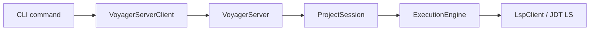

# Project Structure And Reading Guide

This guide reflects the current V1 code structure after the Server-mode and
patch-first refactors.

Project documentation should prefer Mermaid for architecture, flow, lifecycle,
and state-transition diagrams. Directory structures should stay as plain fenced
text trees because they are path indexes, not rendered diagrams. Keep fenced
`bash`, `json`, `python`, or plain path snippets when they are literal examples.

---

## Recommended Document Order

Read these first:

1. [Architecture V1.md](./Architecture%20V1.md)
2. [Voyager Server Mode.md](./Voyager%20Server%20Mode.md)
3. [Apply Pipeline.md](./Apply%20Pipeline.md)
4. [Manual Test Steps for Rename Field.md](./Manual%20Test%20Steps%20for%20Rename%20Field.md)

Use these as supporting references:

- [JDTLS Dependency Management.md](./JDTLS%20Dependency%20Management.md)
- [Example Fixture Pattern.md](./Example%20Fixture%20Pattern.md)

---

## Runtime Model



The CLI is a client. The project-scoped Server owns the long-lived project state
and JDT LS process.

---

## Source Tree

```text
src/
|-- voyager_cmd/          # CLI entrypoints and runner API
|   |-- main.py
|   |-- server.py
|   `-- daemon.py
|-- cli/commands/         # scan/plan/apply presentation
|   |-- scan.py
|   |-- plan.py
|   `-- apply.py
|-- core/
|   |-- server/           # VoyagerServer, client, local protocol
|   |-- session/          # ProjectSession and legacy aliases
|   |-- parser/           # Java parser: LSP first, static fallback
|   |-- graph/            # SemanticGraph and GraphBuilder
|   |-- operation/        # patch-only operation/result models
|   |-- engine/           # plan/apply pipeline
|   |-- vfs/              # virtual filesystem transaction
|   |-- lsp/              # LSP client and language config
|   |-- rules/            # validators
|   `-- diff/             # patch parser and applier
|-- storage/              # .voyager storage manager
`-- utils/                # async helper
```

---

## Persistent State

Voyager stores derived state under the scanned Java project:

```text
.voyager/
|-- graph.json
|-- pending_plan.json
|-- operations.log
|-- rules.yaml
`-- cache/
    |-- server.json
    |-- server.log
    `-- vfs-snapshots/
```

`.voyager/` is rebuildable derived state. It is not source of truth.

---

## Code Reading Paths

### Understand CLI To Server

1. `src/voyager_cmd/main.py`
2. `src/cli/commands/scan.py`
3. `src/cli/commands/plan.py`
4. `src/cli/commands/apply.py`
5. `src/core/server/client.py`

### Understand Server Runtime

1. `src/core/server/protocol.py`
2. `src/core/server/server.py`
3. `src/core/session/project_session.py`
4. `src/storage/manager.py`

### Understand Patch Execution

1. `src/core/operation/models.py`
2. `src/core/engine/execution_engine.py`
3. `src/core/vfs/transaction.py`
4. `src/core/diff/patch_engine.py`
5. `src/core/lsp/client.py`
6. `src/core/rules/validator.py`

### Understand Graph Construction

1. `src/core/parser/java_parser.py`
2. `src/core/graph/builder.py`
3. `src/core/graph/semantic_graph.py`

### Understand Tests

1. `tests/test_static_v1.py`
2. `tests/test_server_v1.py`

---

## Main Commands

```bash
voyager start [project_path]
voyager serve [project_path]
voyager scan <project_path>
voyager plan patch <patch_file> [<patch_file>...]
voyager apply -y
voyager status
voyager stop
```

`start` explicitly starts the project-scoped Server in the background.
`scan/plan/apply` still auto-start a Server for local usage when needed. `serve`
runs the Server in the foreground for debugging or supervised integrations.

One project root maps to one Server process. Multiple terminals or conversations
in the same project reuse that Server; different project roots use independent
Server processes.

---

## Current V1 Limits

- Only Java is implemented.
- The public edit API is patch-only.
- File create/delete/move and semantic refactors should be represented as unified diffs.
- Patch validation uses a VFS transaction and a temporary `.voyager/cache/vfs-snapshots` project snapshot.
- LSP snapshot validation runs when JDT LS is available.
- Static parsing is intentionally conservative.
- Full call graph, Spring DI, Lombok generated-code analysis, reflection, and dynamic proxies are out of V1 scope.
