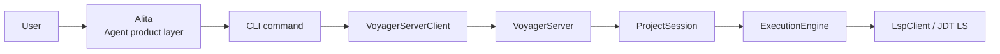

# Project Structure And Reading Guide

This guide reflects the current V1 code structure after the Server-mode and
patch-first refactors.

Project documentation should prefer Mermaid for architecture, flow, lifecycle,
and state-transition diagrams. Directory structures should stay as plain fenced
text trees because they are path indexes, not rendered diagrams. Keep fenced
`bash`, `json`, `python`, or plain path snippets when they are literal examples.

---

## Recommended Document Order

Read these first:

1. [Architecture V1.md](./Architecture%20V1.md)
2. [Alita Agent Workflow.md](./Alita%20Agent%20Workflow.md)
3. [Voyager Server Mode.md](./Voyager%20Server%20Mode.md)
4. [Apply Pipeline.md](./Apply%20Pipeline.md)
5. [Next Steps.md](./Next%20Steps.md)
6. [Manual Test Steps for Patch Flow.md](./Manual%20Test%20Steps%20for%20Patch%20Flow.md)

Use these as supporting references:

- [JDTLS Dependency Management.md](./JDTLS%20Dependency%20Management.md)
- [Example Fixture Pattern.md](./Example%20Fixture%20Pattern.md)

---

## Runtime Model



Alita is the future Agent product layer. Voyager is the lower-level engineering
substrate: CLI/client, Server, graph, patch validation, VFS, JDT LS lifecycle,
and atomic apply. The project-scoped Server owns the long-lived project state
and JDT LS process.

---

## Source Tree

```text
src/
|-- alita/               # early Alita run records, context, policy, tools
|   |-- agent.py
|   |-- context.py
|   |-- policy.py
|   |-- runtime/
|   |-- tools.py
|   |-- tool_commands.py
|   `-- run.py
|-- voyager_cmd/          # CLI entrypoints and runner API
|   |-- main.py
|   |-- server.py
|   `-- daemon.py
|-- cli/commands/         # scan/plan/apply presentation
|   |-- scan.py
|   |-- plan.py
|   |-- apply.py
|   `-- errors.py
|-- core/
|   |-- server/           # VoyagerServer, client, local protocol
|   |-- session/          # ProjectSession and legacy aliases
|   |-- parser/           # Java parser: LSP first, static fallback
|   |-- graph/            # SemanticGraph and GraphBuilder
|   |-- operation/        # patch-only operation/result models
|   |-- engine/           # plan/apply pipeline
|   |-- vfs/              # virtual filesystem transaction
|   |-- lsp/              # LSP client and language config
|   |-- rules/            # validators
|   `-- diff/             # patch parser and applier
|-- storage/              # .voyager storage manager
`-- utils/                # async helper
```

---

## Persistent State

Voyager stores derived state under the scanned Java project:

```text
.voyager/
|-- graph.json
|-- pending_plan.json
|-- operations.log
|-- rules.yaml
`-- cache/
    |-- server.json
    |-- server.log
    `-- vfs-snapshots/
```

`.voyager/` is rebuildable derived state. It is not source of truth.

---

## Code Reading Paths

### Understand CLI To Server

1. `src/voyager_cmd/main.py`
2. `src/cli/commands/scan.py`
3. `src/cli/commands/plan.py`
4. `src/cli/commands/apply.py`
5. `src/core/server/client.py`

### Understand Server Runtime

1. `src/core/server/protocol.py`
2. `src/core/server/server.py`
3. `src/core/session/project_session.py`
4. `src/storage/manager.py`

### Understand Patch Execution

1. `src/core/operation/models.py`
2. `src/core/engine/execution_engine.py`
3. `src/core/vfs/transaction.py`
4. `src/core/diff/patch_engine.py`
5. `src/core/lsp/client.py`
6. `src/core/rules/validator.py`

### Understand Alita MVP

1. `src/alita/context.py`
2. `src/alita/policy.py`
3. `src/alita/runtime/base.py`
4. `src/alita/runtime/providers.py`
5. `src/alita/runtime/adk_runtime.py`
6. `src/alita/tools.py`
7. `src/alita/tool_commands.py`
8. `src/alita/agent.py`
9. `src/alita/run.py`
10. `src/voyager_cmd/main.py`

### Understand Graph Construction

1. `src/core/parser/java_parser.py`
2. `src/core/graph/builder.py`
3. `src/core/graph/semantic_graph.py`

### Understand Tests

1. `tests/test_static_v1.py`
2. `tests/test_server_v1.py`

---

## Main Commands

```bash
voyager start [project_path]
voyager serve [project_path]
voyager scan <project_path>
voyager plan patch <patch_file|-> [<patch_file>...] [--json]
voyager apply -y [--json]
voyager status [--json]
voyager progress [--json]
voyager cancel
voyager alita run "<task>" --patch <patch_file|-> [--active-file <file>] [--json]
voyager alita agent run "<task>" --runtime manual --patch <patch_file|-> [--json]
voyager alita agent run "<task>" --runtime adk --provider <provider> --model <model> [--json]
voyager alita tool plan-patch --patch <patch_file|-> [--json]
voyager alita tool apply-patch --plan current [-y|--yes] [--json]
voyager alita tool status [--json]
voyager stop
```

`start` explicitly starts the project-scoped Server in the background.
`scan/plan/apply` still auto-start a Server for local usage when needed. `serve`
runs the Server in the foreground for debugging or supervised integrations.
`plan patch` accepts Git-style unified diff files or `-` for stdin. `--json`
returns machine-readable results for agent and automation callers.
`alita run` is an early manual-patch Agent-layer MVP: it builds a context pack,
records a patch attempt, calls Voyager plan, and stops before apply.
`alita agent run` is the runtime-backed entrypoint. It currently supports a
deterministic `manual` runtime and an optional Google ADK adapter.
`alita tool plan-patch/apply-patch/status` are the first CLI-first Alita tools
that future ADK tool calls should wrap.

One project root maps to one Server process. Multiple terminals or conversations
in the same project reuse that Server; different project roots use independent
Server processes.

---

## Command Reference

### Server Lifecycle

```bash
# Start or reuse the background Server for a project.
voyager start [project_path]

# Run the Server in the foreground for debugging or supervised integrations.
voyager serve [project_path]

# Stop the Server for the current project.
voyager stop
```

`scan`, `plan`, and `apply` auto-start the project Server when needed, so
`start` is useful but not required for local use.

### Scan

```bash
# Parse Java source and persist .voyager/graph.json.
voyager scan <project_path>
```

`scan` uses the project-scoped Server and reuses its JDT LS process when JDT LS
is available. If JDT LS is not available or gives incomplete facts, Voyager
falls back to the static Java parser.

### Plan Patch

```bash
# Plan one Git-style unified diff file.
voyager plan patch agent.patch

# Plan an ordered patch set as one atomic transaction.
voyager plan patch agent-1.patch agent-2.patch

# Read one patch from stdin.
git diff | voyager plan patch -

# Return a machine-readable PlanResult.
voyager plan patch agent.patch --json
git diff | voyager plan patch - --json
```

`plan patch` validates the patch set and saves `.voyager/pending_plan.json` only
when the plan is valid. It does not write source files.

### Apply Patch

```bash
# Apply the last valid pending plan after skipping the confirmation prompt.
voyager apply -y

# Return a machine-readable ApplyResult.
voyager apply -y --json
```

`apply` revalidates the pending patch operation before writing files. If
validation or commit fails, Voyager rejects the operation and avoids partial
writes when possible.

### Status And Progress

```bash
# Human-readable current project status.
voyager status

# Machine-readable status for agents and automation.
voyager status --json

# Human-readable last operation progress.
voyager progress

# Machine-readable last operation progress.
voyager progress --json

# Record a cancellation request for the current operation.
voyager cancel
```

`cancel` is currently an observability hook. It records the request, but V1 does
not yet interrupt scan, JDT LS, snapshot validation, or apply internals.

### Alita MVP

```bash
# Create an Alita run record and plan a supplied patch file.
voyager alita run "create NewDTO" --patch agent.patch

# Read one patch from stdin.
git diff | voyager alita run "plan current changes" --patch -

# Include an IDE/client active-file hint in the context pack.
voyager alita run "update DTO field" --patch agent.patch --active-file src/main/java/com/shop/OrderDTO.java

# Return machine-readable run, context, and plan data.
voyager alita run "create NewDTO" --patch agent.patch --json
```

The current Alita MVP does not call a model and does not apply source changes.
It writes `.voyager/alita/runs/<run_id>/` artifacts, calls Voyager plan through
the policy-aware Alita tool registry, evaluates HITL write policy for the
future apply step, saves a pending plan when valid and not denied, and stops at
the plan result.

### Alita CLI Tools

```bash
# Plan one patch through the Alita tool registry and save a pending plan.
voyager alita tool plan-patch --patch agent.patch

# Plan an ordered patch set.
voyager alita tool plan-patch --patch agent-1.patch --patch agent-2.patch

# Read one patch from stdin.
git diff | voyager alita tool plan-patch --patch - --json

# Apply the current pending plan after policy allows or the user approves.
voyager alita tool apply-patch --plan current

# Approve ask-user policy decisions non-interactively.
voyager alita tool apply-patch --plan current --yes --json

# Report local Alita pending-plan and latest-run state.
voyager alita tool status --json
```

`plan-patch` is safe for agents to call because it does not write source files.
It saves `.voyager/pending_plan.json` only when the plan is valid and not denied
by policy. `apply-patch` replans the pending operation, evaluates HITL policy,
and applies through Voyager only after `allow`, `auto_execute`, or explicit
approval. In JSON mode, `ask_user` is returned as data instead of opening an
interactive prompt.

### Alita Agent Runtime

```bash
# Model-free local runtime: treat --patch as the runtime-produced patch.
voyager alita agent run "create NewDTO" --runtime manual --patch agent.patch --json

# Optional Google ADK runtime. Requires optional dependencies and provider env.
voyager alita agent run "update DTO" --runtime adk --provider gemini --model <model> --json

# OpenAI-compatible providers can override base URL and API key env when needed.
voyager alita agent run "update DTO" --runtime adk --provider qwen --model <model> --json
```

`alita agent run` writes `runtime-result.json`, `events.jsonl`, the generated
`patch-attempt-1.diff`, and the usual Voyager plan/policy artifacts. The ADK
adapter is optional; install it with:

```bash
pip install -e .[adk]
```

The runtime boundary is intentionally above Voyager. Runtime output is only a
patch proposal. Voyager still validates the patch, Alita policy still gates
future writes, and `apply-patch` remains the explicit write step.

### Typical Human Flow

```bash
cd examples/shop-dto
voyager start .
voyager scan .

git diff > agent.patch
voyager plan patch agent.patch
voyager apply -y

voyager status
voyager stop
```

### Typical Agent Flow

```bash
voyager scan . --help
git diff | voyager plan patch - --json
git diff | voyager alita run "plan current changes" --patch - --json
git diff | voyager alita agent run "plan current changes" --runtime manual --patch - --json
git diff | voyager alita tool plan-patch --patch - --json
voyager alita tool apply-patch --plan current --yes --json
voyager status --json
```

Agents should treat `voyager plan patch` as the safe validation step and
`voyager alita tool apply-patch` as the write step controlled by Alita policy
and HITL rules.

---

## Current V1 Limits

- Only Java is implemented.
- The public edit API is patch-only.
- Alita has an early manual-patch MVP for run records, context packs, and
  Voyager plan integration. `voyager alita run` does not call a model or apply
  files. `voyager alita agent run --runtime adk` is optional and requires
  `google-adk` plus provider credentials. `voyager alita tool apply-patch` can
  apply a pending patch only after policy allows or the user approves.
- Any early command-line entrypoint for Alita should be treated as a development
  integration path, not the final product interaction model.
- File create/delete/move and source edits should be represented as unified diffs.
- Patch validation uses a VFS transaction and a temporary `.voyager/cache/vfs-snapshots` project snapshot.
- LSP snapshot diagnostics run when JDT LS is available and the project has Java build metadata.
- `voyager status` reports JDT LS availability, Java build metadata detection,
  and whether snapshot diagnostics are active.
- `voyager progress` and `voyager cancel` expose the current Server protocol
  skeleton. Cancel requests are recorded, but V1 does not yet interrupt work
  inside scan, JDT LS, or apply checkpoints.
- Static parsing is intentionally conservative.
- The graph records conservative typed field/method/class references and method
  IDs include parameter signatures, but it is not a full Java PSI or call graph.
- Patch inputs and targets are UTF-8 text only; binary, symlink, chmod/mode-only,
  and non-UTF-8 target patches are rejected.
- Full call graph, Spring DI, Lombok generated-code analysis, reflection, and dynamic proxies are out of V1 scope.
