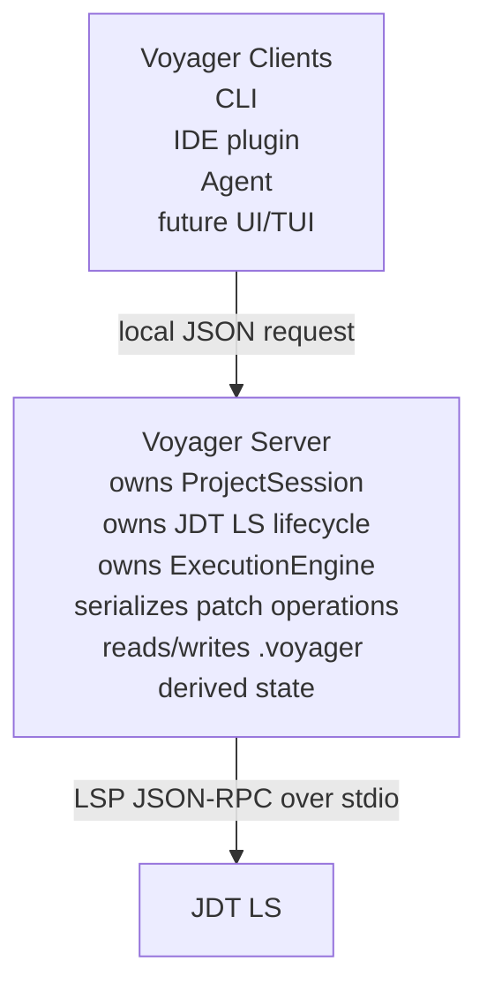
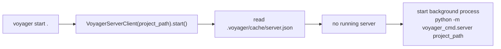
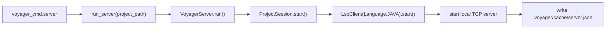
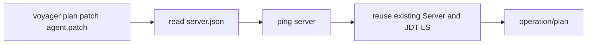
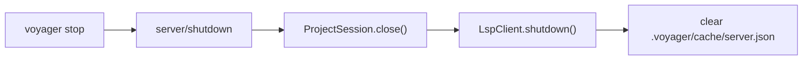

# Voyager V1 Server Mode

## Background

Voyager runs as a project-scoped Server with the CLI acting as a client. This
keeps project context, semantic graph state, and JDT LS lifecycle stable across
`scan -> plan -> apply`.

The original one-command-one-process model was too expensive for JDT LS because
the language server needs startup, initialization, indexing, and a workspace.
Server mode lets short-lived CLI commands reuse one warm project session.

---

## Target Shape



One Java project root maps to one Voyager Server. Multiple terminals inside the
same project reuse that Server. Different project roots use independent Servers.

---

## User Commands

Start a background Server:

```bash
voyager start [project_path]
```

Run a foreground Server for debugging:

```bash
voyager serve [project_path]
```

Normal local flow:

```bash
voyager start .
voyager scan .
voyager plan patch agent.patch
voyager apply -y
voyager stop
```

`scan/plan/apply` auto-start the project Server when needed, so explicit
`start` is convenient but not mandatory.

Status:

```bash
voyager status
```

---

## Core Code Structure

```text
src/core/server/
|-- protocol.py      # ServerInfo, request constants, patch operation deserialization
|-- server.py        # VoyagerServer, owns ProjectSession
`-- client.py        # VoyagerServerClient for CLI/IDE/Agent callers

src/core/session/
|-- project_session.py  # long-lived project session
`-- daemon.py           # legacy compatibility aliases

src/voyager_cmd/
|-- main.py         # CLI: start/serve/scan/plan/apply/status/stop
|-- server.py       # python -m voyager_cmd.server entrypoint
`-- daemon.py       # legacy compatibility entrypoint
```

The main architecture is `core.server` plus `ProjectSession`. Daemon names are
kept only as compatibility wrappers.

---

## Lifecycle

### First CLI Request



### Server Startup



`ProjectSession` is the long-lived state holder:

- `LspClient`: JDT LS process and LSP communication state.
- `ExecutionEngine`: patch plan/apply pipeline.
- `StorageManager`: graph, pending plan, operation log, server state.

### Later CLI Requests



`apply` reuses the same Server and does not restart JDT LS.

### Stop



---

## Local Protocol

The current protocol is newline-delimited JSON over localhost TCP. It is a
minimal local integration layer for CLI, future IDE plugins, and agents.

Request example:

```json
{
  "id": 123,
  "method": "operation/plan",
  "params": {
    "operation": {
      "op": "patch",
      "patch": "--- a/src/main/java/com/shop/OrderDTO.java\n+++ b/src/main/java/com/shop/OrderDTO.java\n@@ ...\n"
    }
  },
  "token": "..."
}
```

Current methods:

| Method | Description |
| --- | --- |
| `server/ping` | Health check; does not take the ProjectSession lock |
| `server/status` | Return Server pid and project path |
| `project/scan` | Parse project and rebuild semantic graph |
| `operation/plan` | Validate patch operation and compute affected files |
| `operation/apply` | Apply patch operation with validation and atomic commit |
| `server/shutdown` | Stop the Server and its JDT LS process |

---

## State Files

Server discovery info is written under the project:

```text
.voyager/cache/server.json
```

Example:

```json
{
  "pid": 19400,
  "host": "127.0.0.1",
  "port": 7003,
  "token": "...",
  "project_path": "D:\\Project\\examples\\shop-dto",
  "protocol": "voyager-jsonrpc-v1"
}
```

Logs are written to:

```text
.voyager/cache/server.log
```

Temporary patch validation snapshots are written under:

```text
.voyager/cache/vfs-snapshots/
```

They are deleted after validation.

---

## Concurrency Model

The Server can accept multiple client connections, but project operations are
serialized with a request lock:

- `project/scan`
- `operation/plan`
- `operation/apply`
- `server/shutdown`

`server/ping` and `server/status` do not take this lock, so health checks do not
block behind long scan/apply work.

---

## scan / plan / apply Call Chains

### scan

```mermaid
flowchart LR
    cli_scan["CLI scan"]
    cli_scan --> client_scan["VoyagerServerClient.scan()"]
    client_scan --> project_scan["project/scan"]
    project_scan --> session_scan["ProjectSession.scan()"]
    session_scan --> parse["parse_java_project_async(lsp_client=reused_client)"]
    parse --> build["GraphBuilder.build()"]
    build --> save["StorageManager.save_graph()"]
```



### plan

```mermaid
flowchart LR
    cli_plan["CLI plan patch"]
    cli_plan --> build_op["build PatchOperation"]
    build_op --> client_plan["VoyagerServerClient.plan(operation)"]
    client_plan --> operation_plan["operation/plan"]
    operation_plan --> session_plan["ProjectSession.plan()"]
    session_plan --> engine_plan["ExecutionEngine.plan_async()"]
    engine_plan --> pre["validate_pre"]
    pre --> vfs["VFS transaction"]
    vfs --> snapshot["snapshot validation"]
    snapshot --> affected["compute affected files"]
    affected --> pending["CLI saves pending_plan.json only when valid"]
```



### apply

```mermaid
flowchart LR
    cli_apply["CLI apply"]
    cli_apply --> read_pending["read pending_plan.json"]
    read_pending --> client_apply["VoyagerServerClient.apply(operation)"]
    client_apply --> operation_apply["operation/apply"]
    operation_apply --> session_apply["ProjectSession.apply()"]
    session_apply --> engine_apply["ExecutionEngine.apply_async()"]
    engine_apply --> pre_apply["validate_pre"]
    pre_apply --> vfs_apply["VFS transaction"]
    vfs_apply --> snapshot_apply["snapshot validation"]
    snapshot_apply --> rebuild["rebuild graph"]
    rebuild --> post["validate_post"]
    post --> commit["commit files"]
    commit --> persist["save graph + operation log"]
```



---

## Verification

Unit tests:

```bash
python -m compileall -q src tests examples/e2e_v1.py
python -m pytest -q
```

Example regression:

```bash
python examples/e2e_v1.py
```

Expected:

- patch set flow passes,
- file create/modify/move/delete lifecycle flow passes,
- multi-project Server isolation flow passes,
- Servers started by the script are stopped.

---

## Next Directions

- Add progress notifications for long scan/index operations.
- Add cancel requests for long-running work.
- Expose a stable JSON-RPC schema for IDE/Agent integrations.
- Strengthen snapshot validation diagnostics.
- Keep the boundary clear: Server executes patch transactions; CLI, IDE, and Agent are clients.
